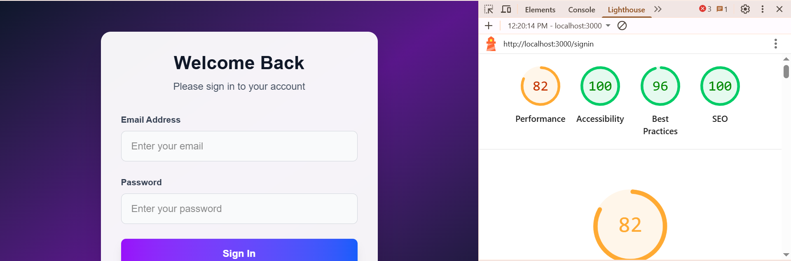

# Sign-In Application

A modern, responsive sign-in application built with Next.js 15, React 19, TypeScript, and Tailwind CSS. Features a beautiful gradient design with glassmorphism effects and smooth animations.

## 🌐 Live Demo

**🔗 [View Live Application](https://sign-in-jade.vercel.app/)**

Experience the application live on Vercel with full functionality and responsive design.

## 🚀 Features

- **Modern UI/UX**: Clean, gradient-based design with glassmorphism effects
- **Responsive Design**: Optimized for all device sizes
- **TypeScript**: Full type safety throughout the application
- **Form Validation**: Client-side validation with error handling
- **Loading States**: Smooth loading indicators and disabled states
- **Success/Error Feedback**: Clear visual feedback for user actions
- **Next.js 15**: Built with the latest Next.js features including Turbopack
- **Tailwind CSS**: Utility-first CSS framework for rapid styling

## 🛠️ Technologies Used

- **Frontend**: Next.js 15, React 19, TypeScript
- **Styling**: Tailwind CSS 4
- **Build Tool**: Turbopack (Next.js)
- **Linting**: ESLint with Next.js configuration

## 📦 Installation

1. Clone the repository:
```bash
git clone <repository-url>
cd sign-in
```

2. Install dependencies:
```bash
npm install
```

3. Run the development server:
```bash
npm run dev
```

4. Open [http://localhost:3000](http://localhost:3000) in your browser.

## 🏗️ Build Commands

- `npm run dev` - Start development server with Turbopack
- `npm run build` - Build for production with Turbopack
- `npm run start` - Start production server
- `npm run lint` - Run ESLint

## 🔐 Demo Credentials

For testing purposes, use these credentials:
- **Email**: `lahiru.jsn@gmail.com`
- **Password**: `1234`

## 📁 Project Structure

```
src/
├── app/
│   ├── api/
│   │   └── signin/
│   │       └── route.ts          # Sign-in API endpoint
│   ├── home/
│   │   └── page.tsx              # Home page after successful sign-in
│   ├── signin/
│   │   └── page.tsx              # Sign-in form component
│   ├── layout.tsx                # Root layout
│   ├── page.tsx                  # Main page (redirects to sign-in)
│   └── globals.css               # Global styles
public/                           # Static assets
```

## 🎨 Design Features

- **Gradient Background**: Beautiful purple-to-slate gradient
- **Glassmorphism**: Semi-transparent cards with backdrop blur
- **Smooth Animations**: CSS transitions for hover and focus states
- **Loading Spinner**: Animated loading indicator during form submission
- **Form Validation**: Real-time validation with error messages
- **Responsive Layout**: Mobile-first design approach

## ⚡ Performance

The application is optimized for performance with:
- Next.js 15 with Turbopack for faster builds and hot reloading
- React 19 for improved rendering performance
- Tailwind CSS for optimized CSS bundle size
- Modern ESLint configuration for code quality



*Performance metrics showing optimized loading times and efficient resource usage*

## 🔧 Configuration Files

- `next.config.ts` - Next.js configuration
- `tailwindcss.config.js` - Tailwind CSS configuration
- `tsconfig.json` - TypeScript configuration
- `eslint.config.mjs` - ESLint configuration
- `postcss.config.mjs` - PostCSS configuration

## 🚀 Deployment

This application can be deployed on various platforms:

### Vercel (Recommended)
1. Push your code to GitHub
2. Connect your repository to Vercel
3. Deploy with zero configuration

### Other Platforms
- Netlify
- Railway
- Digital Ocean
- AWS Amplify

## 📝 API Routes

### POST `/api/signin`

Handles user authentication.

**Request Body:**
```json
{
  "email": "string",
  "password": "string"
}
```

**Response:**
```json
{
  "success": boolean,
  "message": "string"
}
```

## 🤝 Contributing

1. Fork the repository
2. Create a feature branch (`git checkout -b feature/amazing-feature`)
3. Commit your changes (`git commit -m 'Add some amazing feature'`)
4. Push to the branch (`git push origin feature/amazing-feature`)
5. Open a Pull Request

## 📄 License

This project is open source and available under the [MIT License](LICENSE).

## 🙏 Acknowledgments

- Next.js team for the amazing framework
- Tailwind CSS for the utility-first CSS framework
- React team for the powerful UI library

---

Built with ❤️ using Next.js 15 and TypeScript
